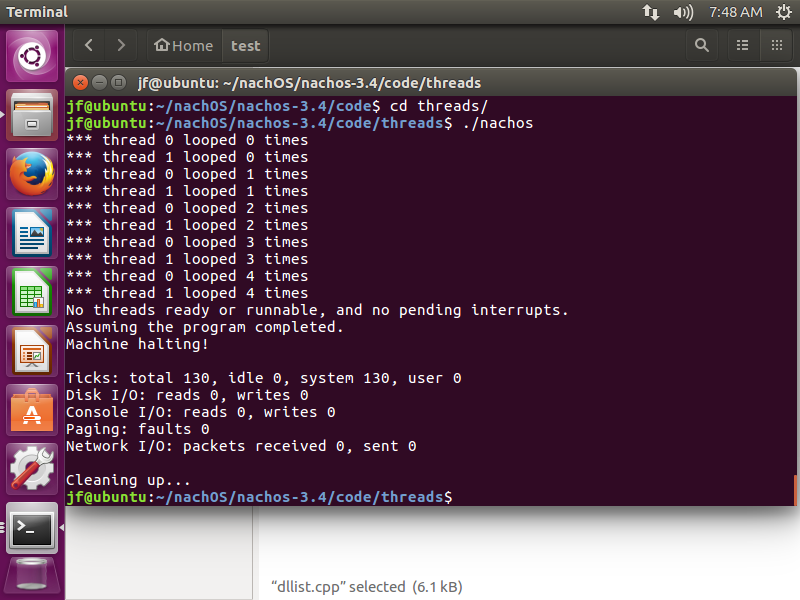
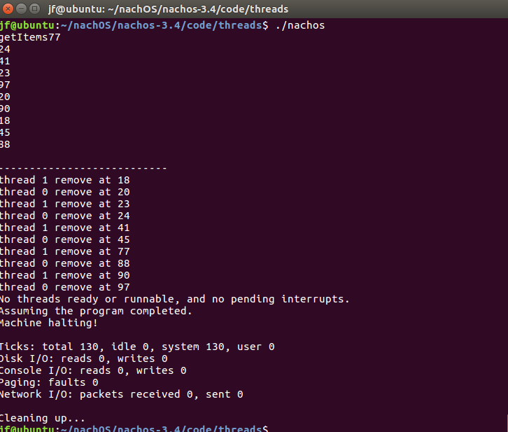

# 操作系统实验报告

## Lab1: 体验NachOS下的并发程序设计

### 1. 安装nachOS

成功安装了nachOS，编译运行结果:



其中，在编译期间发现了错误，已经解决。

错误描述以及解决:

> 如果使用早期的64位Ubuntu版本(4.6以前)，那么使用ld会出现libstdc++.so和libstdc++.a链接不兼容的情况。
>
> 该错误从4.7版本开始被修复，详见[ubuntu社区](https://bugs.launchpad.net/ubuntu/+source/gcc-4.6/+bug/973240)
>
> 解决方案：安装`g++-multilib`支持:
>
> ```
> $ sudo apt-get install `g++-multilib
> ```
>
> 此外，在64位编译下，可能还需要安装一个32位的开发库libc6-dev-i386

### 2. 实现双向有序链表

实现代码见提交部分的code，包含了全部修改的代码

**两个问题:**

1. 因为最初实现是在windows下使用Cmake编译的c++11标准实现的，发现在nachOS中不能使用c++11标准来编译，时间有限，就没有继续深入debug了。于是在Linux下简单删除了c++11的部分代码，但仍保留原始代码在`c++11 version`文件夹下。
2. 在代码中额外使用了一个friend函数，这是为了方便在使用`Prepend()`以及`Append()`时容易找到当前最大以及最小的key。

### 3. 在nachOS线程系统里添加doubly linked list

修改`Makefile.common`以及把文件拷贝到thread文件夹下后，执行make

运行结果:
  
