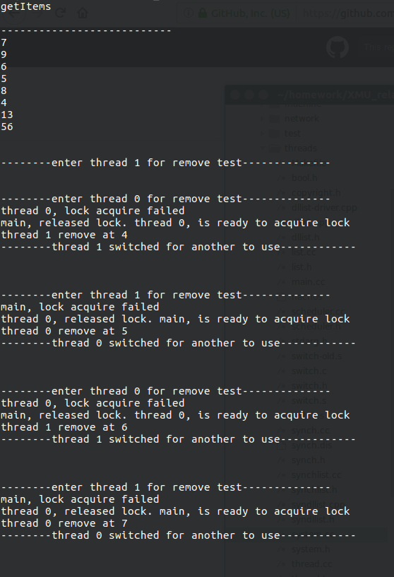
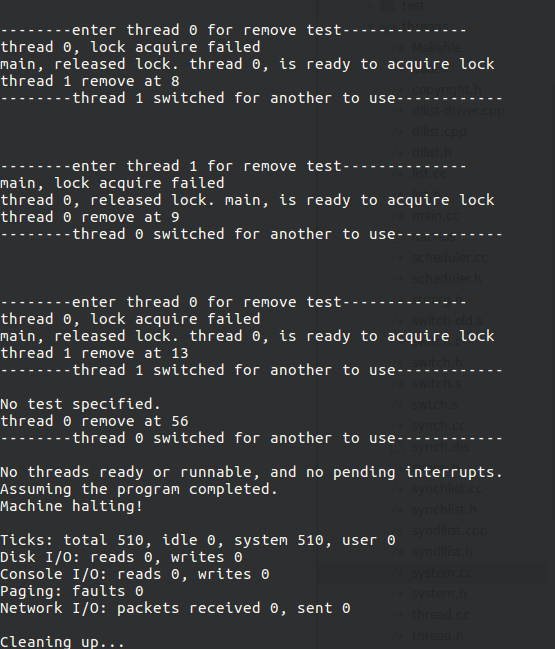
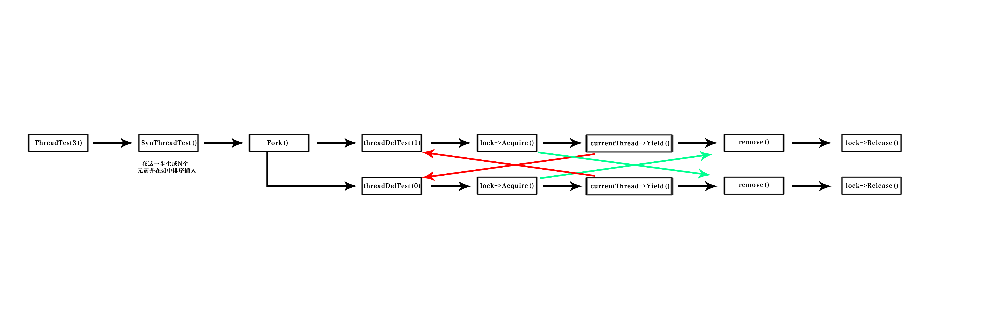

# 操作系统实验报告

## Lab2： 线程与同步

### 1. 实现锁机制和条件变量

#### 1.1 版本一实现

**使用`Thread::Sleep`和`Scheduler::ReadyToRun`实现锁机制和条件变量**

修改了`synch.cc`和`synch.h`的内容，添加了里面关于Lock和condition的内容。

下面是`synch.cc`的内容，这里仅仅列出来加入的Lock和Condition：
```c++
Lock::Lock(char* debugName) {
    name = debugName;
    value = Free;
    waitQueue = new List;
    thread = NULL;
}
Lock::~Lock() {
    delete waitQueue;
}
void Lock::Acquire() {
    IntStatus oldLevel = interrupt->SetLevel(IntOff);   // disable interrupts
    if(value == Busy){
        // using this to indicate lock acquire failed, thread is put into waiting list
        currentThread->Print();
        printf("lock acquire failed\n");

        waitQueue->Append((void *)currentThread);   // append to waiting list and go sleep
        currentThread->Sleep();
    }
    else{
        value = Busy;
        thread = currentThread;             // thread tells who owns lock now
    }
    (void) interrupt->SetLevel(oldLevel);   // re-enable interrupts
}
void Lock::Release() {
    IntStatus oldLevel = interrupt->SetLevel(IntOff);   // disable interrupts
    if(!waitQueue->IsEmpty()){
        Thread* threadtoRun = (Thread*)waitQueue->Remove();
        scheduler->ReadyToRun(threadtoRun);

        // using this to indicate giving lock to another thread
        currentThread->Print();
        printf("released lock. ");
        threadtoRun->Print();
        printf("is ready to acquire lock\n");
    }
    else{
        value = Free;
        thread = NULL;
    }
    (void) interrupt->SetLevel(oldLevel);   // re-enable interrupts
}
bool Lock::isHeldByCurrentThread(){
    return thread == currentThread;
}


Condition::Condition(char* debugName) {
    name = debugName;
    waitNum = 0;
    waitQueue = new List;
}
Condition::~Condition() {
    delete waitQueue;
}
void Condition::Wait(Lock* conditionLock) {
    // only if we have the condition, can we implemtn wait
    ASSERT(conditionLock->isHeldByCurrentThread());         
    waitNum++;
    waitQueue->Append((void *)currentThread);   // so go to sleep
    conditionLock->Release();
    currentThread->Sleep();
    conditionLock->Acquire();
}
void Condition::Signal(Lock* conditionLock) {
    // only if we have the condition, can we implemtn signal
    ASSERT(conditionLock->isHeldByCurrentThread());
    if(waitNum > 0){
        waitNum--;
        Thread* threadtoRun = (Thread*)waitQueue->Remove();
        scheduler->ReadyToRun(threadtoRun);
    }
}
void Condition::Broadcast(Lock* conditionLock) {
    // only if we have the condition, can we implemtn broadcast
    ASSERT(conditionLock->isHeldByCurrentThread());
    while(waitNum > 0){
        waitNum--;
        Thread* threadtoRun = (Thread*)waitQueue->Remove();
        scheduler->ReadyToRun(threadtoRun);
    }
}

```

这部分代码中，在Acquire和Release的时候都加入了调试信息的输出，这样就能在程序运行的时候更好地观察到互斥(接下来的演示部分会讲到)。


---


为了不与Lab1中的内容相冲突，这里重新设计了一个`Syndllist`类，实现方法模仿了nachOS中的示例`SynchList`。

为了说明后面对于互斥的演示，这里贴出来`Syndllist::Remove`函数：

```c++
void *
Syndllist::Remove(int *keyPtr)
{
    void *item;

    lock->Acquire();			// enforce mutual exclusion

    //printf("enter interrupt\n");
    currentThread->Yield();
    //printf("interrupt finished\n");

    while (dllist->isEmpty())
	listEmpty->Wait(lock);		// wait until dllist isn't empty
    item = dllist->Remove(keyPtr);
    ASSERT(item != NULL);
    lock->Release();
    return item;
}
```

注意在其中获得锁之后，加入了一个线程切换。通过这个小技巧，就可以实现对于互斥的测试。

因为在实际程序执行的时候，由于时钟中断，造成线程实际执行的代码并不确定，很有可能在其中某条指令之后，就被强制切断了。而这里的线程切换就是模仿**当线程获得锁之后被强制切断，会不会影响同步内容**

然后修改了`threadtest.cc`，在其中加入了函数`SynThreadTest`和`SynThreadDel`用来测试。为了方便起见，这里就没有使用`dllist-driver.cpp`，而是直接把内容写到`threadtest.cc`中。

```c++
void SynThreadTest(int t){
    int key[N] = {7,9,6,5,8,4,13,56};

    // print out the keys inserted
    for(int i=0;i<N;i++){
        printf("%d\n",key[i]);
    }

    int *item = key;
    for(int i=0;i<N;i++){
        sl.Append((void*)item, key[i]);
    }
}

void SynThreadDel(int t){
    int keyValue;
    for(int i=0;i<N/2;i++){
        printf("\n\n--------enter thread %d for remove test--------------\n",t);
        sl.Remove(&keyValue);
        printf("thread %d remove at %d\n", t, keyValue);
        printf("--------thread %d switched for another to use------------\n\n",t);
        currentThread->Yield();

    }
}
```
注意在`SynThreadDel`中对于调试信息的打印，把每个线程的ID都打印出来了。

加入了第三个测试函数`ThreadTest3`

```c++
// threadtest3, used to test thread with lock and condition implemented.
void ThreadTest3(){
    DEBUG('t', "Entering ThreadTest3");

    Thread *t = new Thread("thread 0");
    printf("getItems\n");

    printf("\n---------------------------\n");

    SynThreadTest(0);
    // fork a new thread to do threadDelTest, allocate thread number as 0
    t->Fork(SynThreadDel, 0);
    // do threadDelTest, allocate thread number as 1
    SynThreadDel(1);
}
```

由于主线程的名字在`system.cc`中构造，为了保证一致性，所以不修改这个名字了。但对于fork的线程我们起名为*thread 0*，对应ID是0，而main线程对应ID是1。

此外，修改了一些常量，加入了一些声明后。

然后编译运行：




可以看出，结果非常有趣。为了更好地说明，做一张图来展示这一过程，这里以最开始的步骤做一个介绍，后续的步骤都是类似的。




- 当fork以后，会出现两个线程。这里分别是线程0和线程1，新fork的线程被放在了等待队列中，所以原来线程继续执行。会进入到`Syndllist`类中的`Remove`函数，观察输出结果，在进入的时候，会打印进入信息

    ```
    --------enter thread 1 for remove test--------------
    ```

- 线程1进入`Remove`之后，第一步执行的就是获得锁操作，即`lock->Acquire()`，如果成功，则没有任何输出。
- 线程1执行`currentThread->Yield()`，线程被强制放弃执行，沿图示中红线进入新的线程0。
- 线程0开始执行，打印进入信息：

  ```
  --------enter thread 0 for remove test--------------
  ```
- 线程0进入`Remove`之后，第一步执行的就是获得锁操作，即`lock->Acquire()`，**但这里由于线程1已经获得了锁，所以这一步中，线程0将无法读取互斥区的内容，锁获得失败，所以被放入到等待队列中，进入休眠，然后按照图示中绿色线条做线程切换**。之后，**线程1执行，执行完毕，交还锁，打印第二条信息。** 打印信息如下：
  ```
  thread 0, lock acquire failed
  main, released lock. thread 0, is ready to acquire lock
  ```
  这里的第一条信息表示线程0获取锁失败，切换回了线程1; 第二条信息表示线程1执行了`dllist`中的`Remove`，然后归还锁，线程0从队列中被唤醒，准备获得锁。由于在`release`中，对于等待线程是直接把它放在就绪队列中，并且不更改value的值，所以当该线程准备获得锁的时候，会马上获得锁。
- 这时候回到`SynThreadDel`中，把移除的key值打印，并把资源自愿给下一个线程使用(上一个线程切换则是模拟了强制资源切换。)
  ```
  thread 1 remove at 4
  --------thread 1 switched for another to use------------
  ```
- 此时线程0开始执行。由于已经获得锁，所以直接进入`currentThread->Yield()`，开始重复和上面类似的内容。

所以前面部分打印出来的信息就是：

```
--------enter thread 1 for remove test--------------


--------enter thread 0 for remove test--------------
thread 0, lock acquire failed
main, released lock. thread 0, is ready to acquire lock
thread 1 remove at 4
--------thread 1 switched for another to use------------


--------enter thread 1 for remove test--------------

```

这个版本的代码打包放在version1中，包含了`threadtest.cc`,`synch.cc`,`synch.h`,`syndllist.h`,`syndllist.cpp`,以及修改过的`Makefile`
