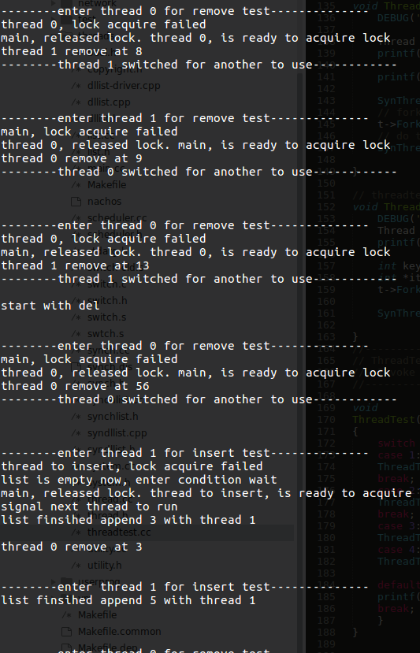

# 操作系统实验报告

## Lab2： 线程与同步

### 1. 实现锁机制和条件变量

#### 1.1 版本一实现

**使用`Thread::Sleep`和`Scheduler::ReadyToRun`实现锁机制和条件变量**, 并且通过`threadtest`文件中的代码进行了测试。

##### <代码部分介绍>

首先, 修改了`synch.cc`和`synch.h`的内容，添加了里面关于Lock和condition的内容。

下面是`synch.cc`的内容，这里仅仅列出来加入的Lock和Condition：
```c++
Lock::Lock(char* debugName) {
    name = debugName;
    value = Free;
    waitQueue = new List;
    thread = NULL;
}
Lock::~Lock() {
    delete waitQueue;
}

void Lock::Acquire() {
    IntStatus oldLevel = interrupt->SetLevel(IntOff);   // disable interrupts
    if(value == Busy){
        // using this to indicate lock acquire failed, thread is put into waiting list
        currentThread->Print();
        printf("lock acquire failed\n");

        waitQueue->Append((void *)currentThread);   // append to waiting list and go sleep
        currentThread->Sleep();
    }
    else{
        value = Busy;
        thread = currentThread;             // thread tells who owns lock now
    }
    (void) interrupt->SetLevel(oldLevel);   // re-enable interrupts
}
void Lock::Release() {
    IntStatus oldLevel = interrupt->SetLevel(IntOff);   // disable interrupts
    if(!waitQueue->IsEmpty()){
        Thread* threadtoRun = (Thread*)waitQueue->Remove();
        scheduler->ReadyToRun(threadtoRun);

        // using this to indicate giving lock to another thread
        currentThread->Print();
        printf("released lock. ");
        threadtoRun->Print();
        printf("is ready to acquire lock\n");
    }
    else{
        value = Free;
        thread = NULL;
    }
    (void) interrupt->SetLevel(oldLevel);   // re-enable interrupts
}
bool Lock::isHeldByCurrentThread(){
    return thread == currentThread;
}


Condition::Condition(char* debugName) {
    name = debugName;
    waitNum = 0;
    waitQueue = new List;
}
Condition::~Condition() {
    delete waitQueue;
}
void Condition::Wait(Lock* conditionLock) {
    waitNum++;
    waitQueue->Append((void *)currentThread);   // so go to sleep
    conditionLock->Release();

    IntStatus oldLevel = interrupt->SetLevel(IntOff);   // disable interrupts
    currentThread->Sleep();             // if we want to make thread sleep, we have to disable ints
    (void) interrupt->SetLevel(oldLevel);   // re-enable interrupts

    conditionLock->Acquire();
}
void Condition::Signal(Lock* conditionLock) {
    if(waitNum > 0){
        waitNum--;
        Thread* threadtoRun = (Thread*)waitQueue->Remove();

        printf("signal next thread to run\n");

        scheduler->ReadyToRun(threadtoRun);
    }
}
void Condition::Broadcast(Lock* conditionLock) {
    while(waitNum > 0){
        waitNum--;
        Thread* threadtoRun = (Thread*)waitQueue->Remove();
        scheduler->ReadyToRun(threadtoRun);
    }
}
```

这部分代码中，除了基本的实现以外, 在Acquire和Release的时候都加入了调试信息的输出，这样就能在程序运行的时候更好地观察到互斥(接下来的测试部分会讲到)。


---


为了不与Lab1中的内容相冲突，这里重新设计了一个`Syndllist`类，实现方法模仿了nachOS中的示例`SynchList`。

为了说明后面对于互斥的演示，这里贴出来`Syndllist::Remove`函数(其它内容在文件里可查看)：

```c++

void *
Syndllist::Remove(int *keyPtr)
{
    void* item;

    lock->Acquire();			// enforce mutual exclusion

    //printf("enter interrupt\n");
    currentThread->Yield();
    //printf("interrupt finished\n");

    while (dllist->isEmpty()){
        printf("list is empty now, enter condition wait\n");
        listEmpty->Wait(lock);       // wait until dllist isn't empty
    }


    item = dllist->Remove(keyPtr);
    ASSERT(item != NULL);
    lock->Release();
    return item;
}

```

注意在**其中获得锁之后，加入了一个线程切换。通过这个小技巧，就可以实现对于互斥的测试**。

因为在实际程序执行的时候，由于时钟中断，造成线程实际执行的代码并不确定，很有可能在其中某条指令之后，就被强制切断了。而这里的线程切换就是模仿**当线程获得锁之后被强制切断，会不会影响同步内容。**

---

然后修改了`threadtest.cc`，在其中加入了函数`SynThreadTest`和`SynThreadDel`用来测试。为了方便起见，这里就没有使用`dllist-driver.cpp`，而是直接把内容写到`threadtest.cc`中。

```c++
void SynThreadBatchAdd(int t){
    int key[N] = {7,9,6,5,8,4,13,56};

    // print out the keys inserted
    for(int i=0;i<N;i++){
        printf("%d\n",key[i]);
    }

    int *item = key;
    for(int i=0;i<N;i++){
        sl.Append((void*)item, key[i]);
    }
}


void SynThreadTestDel(int t){
    int keyValue;
    for(int i=0;i<N/2;i++){
        printf("\n\n--------enter thread %d for remove test--------------\n",t);
        sl.Remove(&keyValue);
        printf("thread %d remove at %d\n", t, keyValue);
        printf("--------thread %d switched for another to use------------\n\n",t);
        currentThread->Yield();
    }
}
```

注意在`SynThreadTestDel`中对于调试信息的打印，把每个线程的ID都打印出来了。

加入了第三个测试函数`ThreadTest3`, 调用前面的两个函数, 来测试Lock是否成功实现。

```c++
// threadtest3, used to test thread with lock and condition implemented.
void ThreadTest3(){
    DEBUG('t', "Entering ThreadTest3");

    Thread* t = new Thread("thread 0");
    printf("getItems\n");

    printf("\n---------------------------\n");

    SynThreadBatchAdd(0);
    // fork a new thread to do threadDelTest, allocate thread number as 0
    t->Fork(SynThreadTestDel, 0);
    // do threadDelTest, allocate thread number as 1
    SynThreadTestDel(1);

}
```

由于主线程的名字在`system.cc`中构造，为了保证一致性，所以不修改这个名字了。但对于fork的线程我们起名为*thread 0*，对应ID是0，而main线程对应ID是1。

这里所做的工作就是对我们实现的Lock做一个测试。

---

此外, 加入了另外两个函数, 来实现`ThreadTest4`, 用来测试Condition是否成功实现。这里都是为了简化, 直接对数组内容作了赋值。而在Lab1中, 我们则是通过`dllist-driver`这个文件实现的。

```c++
void SynThreadInsert(int t){
    const int N = 3;
    int keyValue[N] = {3,5,8};
    for(int i=0;i<N;i++){
        printf("\n\n--------enter thread %d for insert test--------------\n",t);
        int *item = &keyValue[i];
        sl.Append((void*)item, keyValue[i]);
        printf("list finsihed append %d with thread %d\n\n", keyValue[i], t);
        currentThread->Yield();
    }
}


void SynThreadDel(int t){
    const int N = 3;
    int keyValue;
    for(int i=0;i<N;i++){
        printf("\n\n--------enter thread %d for remove test--------------\n",t);
        sl.Remove(&keyValue);
        printf("thread %d remove at %d\n", t, keyValue);
        currentThread->Yield();
    }
}
```

接下来是测试函数`ThreadTest4`

```c++
// threadtest 4, used to test condition variables.
void ThreadTest4(){
    DEBUG('t', "Entering ThreadTest4");
    Thread* t = new Thread("thread to insert");
    printf("start with del\n");

    int key = 5;
    int* item = &key;
    t->Fork(SynThreadInsert, 1);

    SynThreadDel(0);

}
```

这个函数运行的时候, 我们会把前面`Syndllist::Remove`这个函数中间的`currentThread->Yield()`注释掉。因为我们已经测试完锁了, 不需要再做额外的测试, 以让我们的打印结果更加清楚。

---

此外，修改了一些常量，加入了一些声明, 对Makefile文件作了修改。


##### <测试部分介绍>

首先做的测试是Lock的测试, 也就是修改`main.cc`和`threadtest.cc`来调用`ThreadTest3`。

首先看一下测试结果：




从截图可以看出来运行的结果, 为了方便说明, 这里把完整的结果复制下来：

```
jiangfeng@ubuntu:~/OneDrive/Linux/XMU_related/nachOS/Lab2/code/nachOS-lab2-backup/nachOS/nachos-3.4/code/threads$ ./nachos
getItems

---------------------------
7
9
6
5
8
4
13
56


--------enter thread 1 for remove test--------------


--------enter thread 0 for remove test--------------
thread 0, lock acquire failed
main, released lock. thread 0, is ready to acquire lock
thread 1 remove at 4
--------thread 1 switched for another to use------------


--------enter thread 1 for remove test--------------
main, lock acquire failed
thread 0, released lock. main, is ready to acquire lock
thread 0 remove at 5
--------thread 0 switched for another to use------------


--------enter thread 0 for remove test--------------
thread 0, lock acquire failed
main, released lock. thread 0, is ready to acquire lock
thread 1 remove at 6
--------thread 1 switched for another to use------------


--------enter thread 1 for remove test--------------
main, lock acquire failed
thread 0, released lock. main, is ready to acquire lock
thread 0 remove at 7
--------thread 0 switched for another to use------------


--------enter thread 0 for remove test--------------
thread 0, lock acquire failed
main, released lock. thread 0, is ready to acquire lock
thread 1 remove at 8
--------thread 1 switched for another to use------------


--------enter thread 1 for remove test--------------
main, lock acquire failed
thread 0, released lock. main, is ready to acquire lock
thread 0 remove at 9
--------thread 0 switched for another to use------------


--------enter thread 0 for remove test--------------
thread 0, lock acquire failed
main, released lock. thread 0, is ready to acquire lock
thread 1 remove at 13
--------thread 1 switched for another to use------------

start with del


--------enter thread 0 for remove test--------------
main, lock acquire failed
thread 0, released lock. main, is ready to acquire lock
thread 0 remove at 56
--------thread 0 switched for another to use------------


--------enter thread 1 for insert test--------------
thread to insert, lock acquire failed
list is empty now, enter condition wait
main, released lock. thread to insert, is ready to acquire lock
signal next thread to run
list finsihed append 3 with thread 1

thread 0 remove at 3


--------enter thread 1 for insert test--------------
list finsihed append 5 with thread 1


--------enter thread 0 for remove test--------------


--------enter thread 1 for insert test--------------
thread to insert, lock acquire failed
main, released lock. thread to insert, is ready to acquire lock
thread 0 remove at 5
list finsihed append 8 with thread 1


--------enter thread 0 for remove test--------------
thread 0 remove at 8
No test specified.
No threads ready or runnable, and no pending interrupts.
Assuming the program completed.
Machine halting!

Ticks: total 770, idle 0, system 770, user 0
Disk I/O: reads 0, writes 0
Console I/O: reads 0, writes 0
Paging: faults 0
Network I/O: packets received 0, sent 0

Cleaning up...

```


为了详细解释内部发生的事件, 这里做了一个简要的示意图来描述程序的行为：


- 当fork以后，会出现两个线程。这里分别是线程0和线程1，新fork的线程被放在了等待队列中，所以原来线程继续执行。会进入到`Syndllist`类中的`Remove`函数，观察输出结果，在进入的时候，会打印进入信息

    ```
    --------enter thread 1 for remove test--------------
    ```

- 线程1进入`Remove`之后，第一步执行的就是获得锁操作，即`lock->Acquire()`，如果成功，则没有任何输出。
- 线程1执行`currentThread->Yield()`，线程被强制放弃执行，沿图示中红线进入新的线程0。
- 线程0开始执行，打印进入信息：

  ```
  --------enter thread 0 for remove test--------------
  ```
- 线程0进入`Remove`之后，第一步执行的就是获得锁操作，即`lock->Acquire()`，**但这里由于线程1已经获得了锁，所以这一步中，线程0将无法读取互斥区的内容，锁获得失败，所以被放入到等待队列中，进入休眠，然后按照图示中绿色线条做线程切换**。之后，**线程1执行，执行完毕，交还锁，打印第二条信息。** 打印信息如下：
  ```
  thread 0, lock acquire failed
  main, released lock. thread 0, is ready to acquire lock
  ```
  这里的第一条信息表示线程0获取锁失败，当一个线程获得锁失败的时候, 它会被放入休眠队列。所以这时切换回了线程1; 第二条信息表示线程1执行了`dllist`中的`Remove`，然后归还锁，线程0从队列中被唤醒，准备获得锁。由于在`release`中，对于等待线程是直接把它放在就绪队列中，并且不更改value的值，所以当该线程准备获得锁的时候，会马上获得锁。
- 这时候回到`SynThreadDel`中，把移除的key值打印，并把资源自愿给下一个线程使用(上一个线程切换则是模拟了强制资源切换。)
  ```
  thread 1 remove at 4
  --------thread 1 switched for another to use------------
  ```
- 此时线程0开始执行。由于已经获得锁，所以直接进入`currentThread->Yield()`，开始重复和上面类似的内容。

所以前面部分打印出来的信息就是：

```
--------enter thread 1 for remove test--------------


--------enter thread 0 for remove test--------------
thread 0, lock acquire failed
main, released lock. thread 0, is ready to acquire lock
thread 1 remove at 4
--------thread 1 switched for another to use------------


--------enter thread 1 for remove test--------------

```

到了最后删除的时候, 出现了我们在condition里设定的内容。这部分在`ThreadTest4`里介绍。

---

接下来, 讲讲对condition的测试。首先修改testnum为4, 并且把`Syndllist::Remove`里强制线程切换的那个语句注释掉(防止打印信息太多引发混乱)。

编译运行的结果如下：


这里为了简要说明, 仅做了三个元素的删除和插入。

放出打印信息来看一下：

```
jiangfeng@ubuntu:~/OneDrive/Linux/XMU_related/nachOS/Lab2/code/nachOS-lab2-backup/nachOS/nachos-3.4/code/threads$ ./nachos
start with del


--------enter thread 0 for remove test--------------
list is empty now, enter condition wait


--------enter thread 1 for insert test--------------
signal next thread to run
list finsihed append 3 with thread 1

thread 0 remove at 3


--------enter thread 1 for insert test--------------
list finsihed append 5 with thread 1


--------enter thread 0 for remove test--------------
thread 0 remove at 5


--------enter thread 1 for insert test--------------
list finsihed append 8 with thread 1


--------enter thread 0 for remove test--------------
thread 0 remove at 8
No test specified.
No threads ready or runnable, and no pending interrupts.
Assuming the program completed.
Machine halting!

Ticks: total 240, idle 0, system 240, user 0
Disk I/O: reads 0, writes 0
Console I/O: reads 0, writes 0
Paging: faults 0
Network I/O: packets received 0, sent 0

Cleaning up...

```

在`ThreadTest4`里, 我们创建了新的线程指针后, 直接进行了Fork操作, 在两个线程中, 我们分别做了删除和插入。并且删除先执行。结合框图这里做一个详细的说明：


- 首先Fork之后, 主线程, 即线程0, 进入`SynThreadDel`函数, 在这个函数里, 调用了删除操作`Syndllist::Remove`。打印信息：

  ```
  --------enter thread 0 for remove test--------------
  ```

- 由于此时我们的syndlist为空, 所以在获得锁之后, 在条件变量`listEmpty`的判断中不满足条件。因此执行了`Wait`, 被放入到等待线程, 放弃CPU, 等待`signal`或者`broadcast`唤醒。打印信息：

  ```
  list is empty now, enter condition wait
  ```

- 这时跳回了我们的另一个线程, 即线程1, 执行`Syndllist::Append`, 将元素加入到线程中。打印了两条信息, 分别是进入时候的打印, 以及在插入后执行`signal`时的打印。

  ```
  --------enter thread 1 for insert test--------------
  signal next thread to run
  ```

- `signal`只是唤醒其它等待线程, 并不马上执行, 所以这时候线程1继续执行, 直到结束, 打印出结束信息, 然后`Yield`：

  ```
  list finsihed append 3 with thread 1
  ```

- 此时线程切换到线程0, 被唤醒的它发现满足了`listEmpty`条件, 继续执行删除, 并打印出信息：

  ```
  thread 0 remove at 3
  ```

  然后执行结束后, 再次切换线程。

这一部分就是开头我们打印信息的执行过程：

```
--------enter thread 0 for remove test--------------
list is empty now, enter condition wait


--------enter thread 1 for insert test--------------
signal next thread to run
list finsihed append 3 with thread 1

thread 0 remove at 3
```

再后面, 执行就正常地插入和删除, 条件每次都得到了满足。

---

##### 总结

这个版本的代码打包放在version1中，包含了`threadtest.cc`,`synch.cc`,`synch.h`,`syndllist.h`,`syndllist.cpp`,以及修改过的`Makefile`

---

#### 1.2 版本二实现

类似版本一，但使用了`Semaphore`的操作来实现，和version1类似，在`threadtest`里进行了测试。

由于主要内容没有大的变化，仅仅改变了`Lock`和`Condition`的实现方式。这里就不做详细的介绍了。


### 2. 实现一个线程安全的表结构

修改过的代码放在了`\Lab2\code\table`目录下，table的实现并不复杂，使用一个`void**`来作为table entry存储`void*`，使用一个int数组来存储每个位置的状态，结构简单，操作迅速。

其中在Alloc函数里用到了锁的操作，防止两个线程同时分配的时候做写入
```c++
int Table::Alloc(void *object)
{
	for(int i=0;i<sz;i++){	// do a simple loop, find first empty slot
		lock->Acquire();
		if(idx[i] == 0){
			tb[i] = object;
			idx[i] = 1;
			lock->Release();
			return i;
		}
		lock->Release();
	}
	return -1;		// if there is no empty slot, return -1
}
```

这里对于空slot的寻找使用了最简单的顺序调度思想，如果需要优化SSD的随机读写， 还可以进一步扩展使用随机寻找。

其它代码都较为简单，这里就不再叙述了，可以直接阅读代码及注释。

### 3. 实现一个大小受限的缓冲区

这个内容极为Reader-Writer问题的求解。

这里采用了一个锁加两个条件变量来实现, 并使用了四个变量ar, wr, aw, ww来表示四种不同的人。使用此前实现的`Table`结构来存储内容。

内容与课堂的内容类似, 没有什么创新的内容, 不做过多的介绍了。
