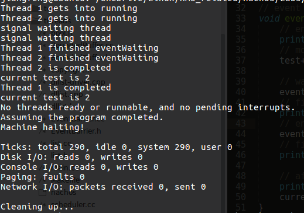
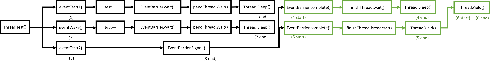
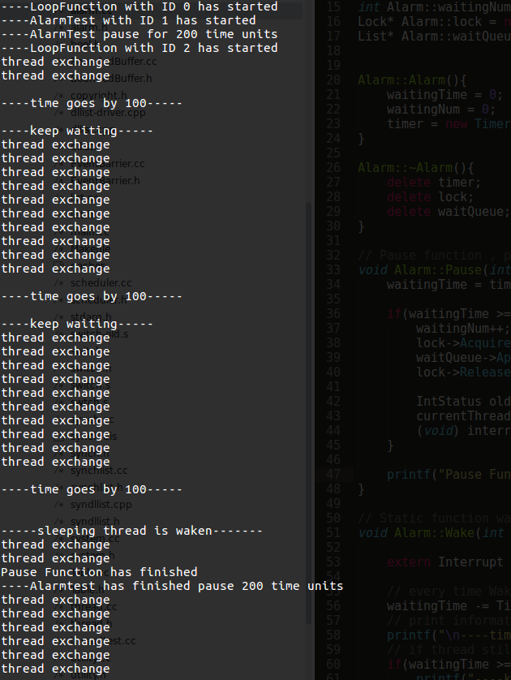
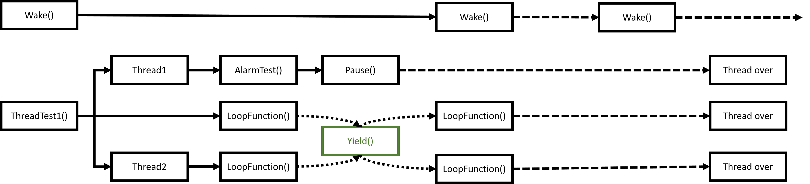

# 操作系统实验报告

## Lab3： nachos下的线程编程

### 1. 事件栅栏

所谓的事件栅栏(Event Barrier), 就像一个强制同步, 使用这个功能来让所有的线程都停在某个地方, 然后同时通过。调用的方式也很简单, 就是在线程内部, 在要通过的地方使用两个函数：`Wait()`和`Complete()`; 而另外开启栅栏则通过`Signal()`函数实现。

这里合理的实现应该是在EventBarrier里对所有相关的线程都做记录, 采用一个结构体, 对PID, 名称, 状态等做记录。但这样的可变长度的结构在nachOS里实现起来较为麻烦。这里直接使用一个trick, 不记录线程的名称和参数, 因为nachOS本质上是单线程的执行, 所有的线程都依次执行, 所以仅记录等待事件的个数, 反正他们都会被依次调用(只要我们不额外声明其它线程即可)。

代码：

看头文件：
```C++
class EventBarrier {
	public:
		EventBarrier(char* eventname);
		~EventBarrier();

		void Wait();
		void Signal();
		void Complete();

	private:
		char* eventName;
		enum STATE {signaled, unsignaled} state;
		int waitingNum;
		int maxWait;
		int completeNum;
		Lock *lock;
		Condition *pendThread;
		Condition *finishThread;
};
```

其中使用`enum`类型来记录当前event的状态, 并使用了三个计数变量, 一个Lock以及两个Condition用来让等待的线程休眠。

看一下cc文件里对于三个主要函数的实现：
```C++
void EventBarrier::Wait(){
	lock->Acquire();
	// actually state will never be signaled, because Signal() always
	// turn off signal after wake up waiting threads
	if(state == signaled){
		lock->Release();
	}
	else{
		waitingNum++;
		pendThread->Wait(lock);
		lock->Release();
	}
}

// mark waitingNum, wake up all waiting thread, then lock the signal again
void EventBarrier::Signal(){
	lock->Acquire();
	maxWait = waitingNum;
	state = signaled;
	while(waitingNum != 0){
		printf("signal waiting thread\n");
		pendThread->Signal(lock);
		waitingNum--;
	}
	state = unsignaled;
	lock->Release();
}

// used to make sure all threads have finished waiting
void EventBarrier::Complete(){
	lock->Acquire();
	// if this is the last thread to call this function
	while(completeNum != (maxWait-1)){
		completeNum++;
		finishThread->Wait(lock);
		return;
	}
	// then wake up all sleeping threads
	finishThread->Broadcast(lock);
	lock->Release();
}
```

内容不是很复杂, 结合注释应该很容易看懂。这里要注意的一点是, 我们对于等待线程的处理都是使用Condition来进行休眠, 结合前面我们对Condition的实现就应该明白, 在Condition里, 我们把线程用一个链表进行了记录然后就从执行队列中拿下来了, 这里可能导致的一个问题就是, 如果我们不及时对等待的线程进行`Signal()`, 那么可能造成的结果就是当前没有执行的线程, nachOS关机。

设计测试程序, `threadtest.cc`:
```C++
void eventTest(int num){
    // enter thread.
    printf("%s gets into running\n", currentThread->getName());
    // modify test
    test++;

    // wait for event
    event.Wait();
    // finished event, print out message
    printf("%s finished eventWaiting\n", currentThread->getName());
    // enter complete
    event.Complete();
    // finished complete, print out message
    printf("%s is completed\n", currentThread->getName());

    // after passing event barrier, print out current value for test
    printf("current test is %d\n", test);
    currentThread->Yield();
}

// eventWake used to signal
void eventWake(int num){
    // give up currnet resource, since this will be the first thread to run
    currentThread->Yield();
    event.Signal();
    //currentThread->Yield();
}
```

设置多个线程执行`eventTest()`, 他们会陆续被休止在事件处, 等待`Signal()`。另外设立一个线程执行`eventWake()`, 令其他线程通过。如果执行正确, 那么打印出来的测试值`test`就应该是线程的个数, 而不会有线程提前执行到这一步将其打印。

为了让`threadtest.cc`看起来简洁一些, 这部分把其他无关的测试内容都做了删除, 仅留下`ThreadTest1()`来执行Event Barrier的测试：

```C++
ThreadTest1()
{
    DEBUG('t', "Entering ThreadTest1");

    // create two thread, to make result cleaner.
    Thread * t1 = new Thread("Thread 1");
    Thread * t2 = new Thread("Thread 2");
    //Thread * t3 = new Thread("signal thread 3");

    t1->Fork(eventTest, 1);
    t2->Fork(eventTest, 2);
    //t3->Fork(eventWake, 3);

    eventWake(0);
}

```

这里仅使用了三个线程, 两个执行`eventTest()`,一个执行`eventWake()`。

注意在注释里的代码部分是另一个版本的测试, 结合上面两个函数的注释代码, 演示了如果不及时进行`Signal()`的话nachOS会被停机。这里不做详细介绍了。

运行结果：



结合打印的内容也很清楚程序是怎么运行的了。

对运行结果：
```
Thread 1 gets into running
Thread 2 gets into running
signal waiting thread
signal waiting thread
Thread 1 finished eventWaiting
Thread 2 finished eventWaiting
Thread 2 is completed
current test is 2
Thread 1 is completed
current test is 2
No threads ready or runnable, and no pending interrupts.
Assuming the program completed.
Machine halting!

Ticks: total 290, idle 0, system 290, user 0
Disk I/O: reads 0, writes 0
Console I/O: reads 0, writes 0
Paging: faults 0
Network I/O: packets received 0, sent 0

Cleaning up...


```
这里做一个框图来介绍：



- 首先从`ThreadTest()`开始, fork了两个线程, 加上原来的线程, 构成了三个线程。
- 由于`eventTest()`里做了`Yield()`操作, 所以先执行(1)的内容, 这时打印信息：
```
Thread 1 gets into running
```
一直到(1 end), 这时候在condition里线程被休眠。
- 然后执行下一个线程(2), 和(1)一样, 打印信息：
```
Thread 2 gets into running
```
在condition里线程被休眠, 切换到(3)。
- 在(3)里, 进行`Signal()`操作, 打印信息：
```
signal waiting thread
signal waiting thread
```
(3)结束, (1),(2)被唤醒, 首先是(1), 开始进入(4)部分
- 被唤醒的线程结束了`Wait()`, 首先打印信息：
```
Thread 1 finished eventWaiting
```
开始执行`Complete()`, 由于还有其他的线程没有`Complete`,所以它进入了另一个Condition, 被休眠。
- 切换到另一个就绪线程, 执行(5), 首先打印信息：
```
Thread 2 finished eventWaiting
```
由于它是最后一个`Complete()`线程了, 所以把其他所有线程就绪。然后它持续执行到结束。打印出`Complete`信息, 并且打印`test`的值：
```
Thread 2 is completed
current test is 2
```
- (5)结束后, 还剩下一个就绪线程, 所以执行(6), 结束`Complete`, 并且打印`test`的值：
```
Thread 1 is completed
current test is 2
```

修改的代码包括`threadtest.cc`,`Makefile`, `Makefile.com`, `EventBarrier.cc`,`EventBarrier.h`

### 2. 闹钟原语

#### 2.1. 存在的问题解释

在实现之后, 发现一个问题：由于在`Interrupt::SetLevel()`执行的时候, 内部存在一个`Interrupt::OneTick()`的强制时间前进的调用, 而这一函数中会对中断做`CheckIfDue()`的检查, 如果没有达到执行时间, 那么会重新放回pending队列中等待。而`thread`的操作中都会做`SetLevel()`来回归context switch之前的内容!!!! 这也就是说, **如果我们在pending队列里放入一个以上的内容, 那么程序就永远不会停下去, 即便只有一个线程, 但是线程在做操作(例如sleep, yield)的时候会依次检查pending中的内容, 导致状态复原与继续**。

因此, 在加入一个新的时间中断的时候, 必须把旧的关闭, 也就是说, **nachOS内部pending队列中只能同时允许一个中断存在, 否则就会因为依次检测而不为空导致nachOS永远执行下去**。

因此在实现的时候, 我们要修改`system.cc`的内容, 把其中原有的Timer关掉, 换成我们的Alarm。(我们在Alarm内部使用Timer来实现)。

#### 2.2 实现

首先是`alarm.h`的代码：
```c++
class Alarm{
public:
	Alarm();
	~Alarm();

	// Pause function, called by thread, to sleep for a timePeriod
	void Pause(int timePeriod);

	// Wake function as VoidFunctionPtr to pass into timer
	// due to VoidFunctionPtr constraint, it has to be static function
	static void Wake(int dummy);

private:
  	Timer* timer;

	  // since static function can only access static data, so we declare
	  // these variables as static
  	static int waitingNum;		// used to record waiting numbers for pause threads
  	static int waitingTime;		// used to record waiting time for waiting thread
  	static Lock* lock;			// lock used to put pausing thread into queue
  	static List* waitQueue;		// waitingQueue, used for pausing threads storage
};
```

在这里主要实现了两个函数, 分别是`Pause(int timePeriod)`, 用来使线程暂停timePeriod时间。但实际上, 线程所暂停的时间总是要比timePeriod长, 这时因为两个原因：

- 等待timePeriod结束后, 线程并不会马上被唤醒。
- 时间中断是以一个`TimerTicks`为单位所记录的, 这是一个定义在`stats.h`里的一个宏常亮。每当过去一个`TimerTicks`才会有一个中断检查。所以实际线程等待的时间至少是TimerTicks的整数倍。

注意到这里的`Wake`函数和部分的成员变量使用了static类型, 这是因为在Timer中使用的中断处理服务(IRQ service)VoidFunctionPtr必须是静态函数。而类中的static function只能使用static member。这些内容的初始化也是全局的, 在`alarm.cc`中初始化。

接下来看一下`alarm.cc`的代码：
```C++
// since these variables are all staic variables,
// we cannot initialize them in constructor, so we
// initialize them here
int Alarm::waitingTime = 0;
int Alarm::waitingNum = 0;
Lock* Alarm::lock = new Lock("alarm lock");
List* Alarm::waitQueue = new List;


Alarm::Alarm(){
	waitingTime = 0;		// re-initialize these variables as 0
	waitingNum = 0;
	timer = new Timer(Wake, 0, 0);		// register a timer
}

Alarm::~Alarm(){
	delete timer;
	delete lock;
	delete waitQueue;
}

// Pause function , pause for a timePeriod
void Alarm::Pause(int timePeriod){		
	waitingTime = timePeriod;		// set waiting time as timePeriod

	if(waitingTime >= 0){		// if waiting time is greater than 0, then keep thread state and put it into sleep
		waitingNum++;
		lock->Acquire();		// enforce mutual exclusive access to the list
		waitQueue->Append((void *)currentThread);   // so go to sleep
	    lock->Release();

	    IntStatus oldLevel = interrupt->SetLevel(IntOff);   // disable interrupts
	    currentThread->Sleep();             // if we want to make thread sleep, we have to disable ints
	    (void) interrupt->SetLevel(oldLevel);   // re-enable interrupts
	}

	printf("Pause Function has finished\n");
}

// Static function wake, used in Timer, as IRQ service
void Alarm::Wake(int dummy){

	extern Interrupt *interrupt;			// interrupt status, decleared in system.cc

	// every time Wake is called, we would decrease waitingTime.
    waitingTime -= TimerTicks;
	// print information, tell that it's another TimerTicks passed
    printf("\n----time goes by %d-----\n\n", TimerTicks);
	// if thread still haven't finished waiting, then keep waiting
    if(waitingTime >= 0){
        printf("----keep waiting-----\n");
    }
    else{
		// if thread has finished waiting, take it from queue, put it on readyQueue
    	if(waitingNum>0){
    		Thread* threadtoRun = (Thread*)waitQueue->Remove();
        	scheduler->ReadyToRun(threadtoRun);
        	waitingTime = 0;
        	waitingNum--;
        	printf("\n-----sleeping thread is waken-------\n");
    	}
    }
}
```

这里的实现并不复杂, 其中关于让线程休眠和唤醒的部分, 直接参考使用了Lab2中的关于Lock, Condition, Semphore中的内容。

简单来讲, `Pause`函数就是判断如果timePeriod是一个大于0的量, 那么就把线程放入等待队列中, 然后休眠。`Wake`函数就是在被调用的时候, 把等待时间减小, 当等待时间减到小于等于0的时候, 那么就把线程从等待队列中取出, 放到就绪队列中。

这里队列的实现较为完备, 但waitingTime仅仅用了简单的int变量。所以这个Alarm仅支持单个线程调用。由于这里仅作演示, 因此没有过于复杂的实现。如果要支持多线程使用Pause操作, 仅需把waitingTime改成数组来实现(即把它声明为pointer), 在wake函数里稍作修改即可使用。

其次, 在`system.cc`中, 加入头文件`alarm.h`, 在全局声明中, 加入了Alarm* alarm, 并把后面关于Timer的内容注释掉了。修改较为简单, 这里就不把全部代码放上来了。

最后是修改较大的`threadtest.cc`：

```C++
void AlarmTest(int arg){
	// alarm is declared in system.cc
    extern Alarm* alarm;
	// indicate that this thread has started
    printf("----AlarmTest with ID %d has started\n",arg);
	// ready to enter pause
    printf("----AlarmTest pause for 200 time units\n");
	// do pause
    alarm->Pause(200);
	// tell that pause has finished
    printf("----Alarmtest has finished pause 200 time units\n");
	// give up resource
    currentThread->Yield();
}

// dummy loop function, to make sure there is something running, or nachOS would halt
void loopFunction(int arg){
	// indicate that this thread has started
    printf("----LoopFunction with ID %d has started\n",arg);
	// we have to give up resource first, if we don't, then we would continue until this thread exit
    currentThread->Yield();
	// 15 times Yield
    int time = 15;
    while(time > 0){
        time--;
        printf("thread exchange\n");
        currentThread->Yield();
    }

}


void
ThreadTest1()
{
    DEBUG('t', "Entering ThreadTest1");

    // create two thread, to make result cleaner.
    Thread *t1 = new Thread("Thread 1");
    Thread *t2 = new Thread("Thread 2");

    t1->Fork(AlarmTest, 1);
    t2->Fork(loopFunction, 2);

    loopFunction(0);
}
```

为了让内容看起来更加整洁, 这里同样把Lab3第一部分关于事件栅栏的内容删除。 在ThreadTest1中, 我们新建了两个线程, 分别调用了`AlarmTest`和`LoopFunction`, 结合main中的`LoopFunction`, 我们共有三个线程。代码较为简单, 就不多介绍了。此外修改了Makefile, 最后看一下运行结果：


运行结果文字的copy：
```
----LoopFunction with ID 0 has started
----AlarmTest with ID 1 has started
----AlarmTest pause for 200 time units
----LoopFunction with ID 2 has started
thread exchange
thread exchange

----time goes by 100-----

----keep waiting-----
thread exchange
thread exchange
thread exchange
thread exchange
thread exchange
thread exchange
thread exchange
thread exchange
thread exchange
thread exchange

----time goes by 100-----

----keep waiting-----
thread exchange
thread exchange
thread exchange
thread exchange
thread exchange
thread exchange
thread exchange
thread exchange
thread exchange
thread exchange

----time goes by 100-----


-----sleeping thread is waken-------
thread exchange
thread exchange
Pause Function has finished
----Alarmtest has finished pause 200 time units
thread exchange
thread exchange
thread exchange
thread exchange
thread exchange
thread exchange

----time goes by 100-----

No threads ready or runnable, and no pending interrupts.
Assuming the program completed.
Machine halting!

Ticks: total 500, idle 90, system 410, user 0
Disk I/O: reads 0, writes 0
Console I/O: reads 0, writes 0
Paging: faults 0
Network I/O: packets received 0, sent 0

Cleaning up...
```

同样用一张图来说明：



可以看到, `Wake()`作为IRQ service, 始终存在, 并在指定的时间后执行一次。

而我们main函数中一直调用到`ThreadTest1()`, 在这里新建了两个线程, 并与自身组合成了三个线程。这三个线程两个是作为LoopFunction不断被调用并且Yield(为了推进时间)。而另一个线程则陷入了Pause()。

此外, Wake()会定期做检查, 每当发现了有等待线程, 就会查看等待线程等待时间是否已经达到。**每一次Wake()被调用, 就会打印输出----time goes by 100-----的字样**

这里内容不是很复杂, 结合注释应该很容易理解, 就不多介绍了。

修改的文件有`alarm.h`, `alarm.cc`, `threadtest.cc`, `Makefile`, `Makefile.common`

### 3. 电梯问题
