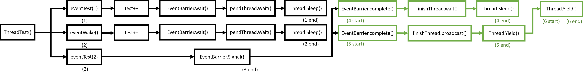

# 操作系统实验报告

## Lab3： nachos下的线程编程

### 1. 事件栅栏

所谓的事件栅栏(Event Barrier), 就像一个强制同步, 使用这个功能来让所有的线程都停在某个地方, 然后同时通过。调用的方式也很简单, 就是在线程内部, 在要通过的地方使用两个函数：`Wait()`和`Complete()`; 而另外开启栅栏则通过`Signal()`函数实现。

这里合理的实现应该是在EventBarrier里对所有相关的线程都做记录, 采用一个结构体, 对PID, 名称, 状态等做记录。但这样的可变长度的结构在nachOS里实现起来较为麻烦。这里直接使用一个trick, 不记录线程的名称和参数, 因为nachOS本质上是单线程的执行, 所有的线程都依次执行, 所以仅记录等待事件的个数, 反正他们都会被依次调用(只要我们不额外声明其它线程即可)。

代码：

看头文件：
```C++
class EventBarrier {
	public:
		EventBarrier(char* eventname);
		~EventBarrier();

		void Wait();
		void Signal();
		void Complete();

	private:
		char* eventName;
		enum STATE {signaled, unsignaled} state;
		int waitingNum;
		int maxWait;
		int completeNum;
		Lock *lock;
		Condition *pendThread;
		Condition *finishThread;
};
```

其中使用`enum`类型来记录当前event的状态, 并使用了三个计数变量, 一个Lock以及两个Condition用来让等待的线程休眠。

看一下cc文件里对于三个主要函数的实现：
```C++
void EventBarrier::Wait(){
	lock->Acquire();
	// actually state will never be signaled, because Signal() always
	// turn off signal after wake up waiting threads
	if(state == signaled){
		lock->Release();
	}
	else{
		waitingNum++;
		pendThread->Wait(lock);
		lock->Release();
	}
}

// mark waitingNum, wake up all waiting thread, then lock the signal again
void EventBarrier::Signal(){
	lock->Acquire();
	maxWait = waitingNum;
	state = signaled;
	while(waitingNum != 0){
		printf("signal waiting thread\n");
		pendThread->Signal(lock);
		waitingNum--;
	}
	state = unsignaled;
	lock->Release();
}

// used to make sure all threads have finished waiting
void EventBarrier::Complete(){
	lock->Acquire();
	// if this is the last thread to call this function
	while(completeNum != (maxWait-1)){
		completeNum++;
		finishThread->Wait(lock);
		return;
	}
	// then wake up all sleeping threads
	finishThread->Broadcast(lock);
	lock->Release();
}
```

内容不是很复杂, 结合注释应该很容易看懂。这里要注意的一点是, 我们对于等待线程的处理都是使用Condition来进行休眠, 结合前面我们对Condition的实现就应该明白, 在Condition里, 我们把线程用一个链表进行了记录然后就从执行队列中拿下来了, 这里可能导致的一个问题就是, 如果我们不及时对等待的线程进行`Signal()`, 那么可能造成的结果就是当前没有执行的线程, nachOS关机。

设计测试程序, `threadtest.cc`:
```C++
void eventTest(int num){
    // enter thread.
    printf("%s gets into running\n", currentThread->getName());
    // modify test
    test++;

    // wait for event
    event.Wait();
    // finished event, print out message
    printf("%s finished eventWaiting\n", currentThread->getName());
    // enter complete
    event.Complete();
    // finished complete, print out message
    printf("%s is completed\n", currentThread->getName());

    // after passing event barrier, print out current value for test
    printf("current test is %d\n", test);
    currentThread->Yield();
}

// eventWake used to signal
void eventWake(int num){
    // give up currnet resource, since this will be the first thread to run
    currentThread->Yield();
    event.Signal();
    //currentThread->Yield();
}
```

设置多个线程执行`eventTest()`, 他们会陆续被休止在事件处, 等待`Signal()`。另外设立一个线程执行`eventWake()`, 令其他线程通过。如果执行正确, 那么打印出来的测试值`test`就应该是线程的个数, 而不会有线程提前执行到这一步将其打印。

为了让`threadtest.cc`看起来简洁一些, 这部分把其他无关的测试内容都做了删除, 仅留下`ThreadTest1()`来执行Event Barrier的测试：

```C++
ThreadTest1()
{
    DEBUG('t', "Entering ThreadTest1");

    // create two thread, to make result cleaner.
    Thread * t1 = new Thread("Thread 1");
    Thread * t2 = new Thread("Thread 2");
    //Thread * t3 = new Thread("signal thread 3");

    t1->Fork(eventTest, 1);
    t2->Fork(eventTest, 2);
    //t3->Fork(eventWake, 3);

    eventWake(0);
}

```

这里仅使用了三个线程, 两个执行`eventTest()`,一个执行`eventWake()`。

注意在注释里的代码部分是另一个版本的测试, 结合上面两个函数的注释代码, 演示了如果不及时进行`Signal()`的话nachOS会被停机。这里不做详细介绍了。

运行结果：


结合打印的内容也很清楚程序是怎么运行的了。

对运行结果：
```
Thread 1 gets into running
Thread 2 gets into running
signal waiting thread
signal waiting thread
Thread 1 finished eventWaiting
Thread 2 finished eventWaiting
Thread 2 is completed
current test is 2
Thread 1 is completed
current test is 2
No threads ready or runnable, and no pending interrupts.
Assuming the program completed.
Machine halting!

Ticks: total 290, idle 0, system 290, user 0
Disk I/O: reads 0, writes 0
Console I/O: reads 0, writes 0
Paging: faults 0
Network I/O: packets received 0, sent 0

Cleaning up...


```
这里做一个框图来介绍：



- 首先从`ThreadTest()`开始, fork了两个线程, 加上原来的线程, 构成了三个线程。
- 由于`eventTest()`里做了`Yield()`操作, 所以先执行(1)的内容, 这时打印信息：
```
Thread 1 gets into running
```
一直到(1 end), 这时候在condition里线程被休眠。
- 然后执行下一个线程(2), 和(1)一样, 打印信息：
```
Thread 2 gets into running
```
在condition里线程被休眠, 切换到(3)。
- 在(3)里, 进行`Signal()`操作, 打印信息：
```
signal waiting thread
signal waiting thread
```
(3)结束, (1),(2)被唤醒, 首先是(1), 开始进入(4)部分
- 被唤醒的线程结束了`Wait()`, 首先打印信息：
```
Thread 1 finished eventWaiting
```
开始执行`Complete()`, 由于还有其他的线程没有`Complete`,所以它进入了另一个Condition, 被休眠。
- 切换到另一个就绪线程, 执行(5), 首先打印信息：
```
Thread 2 finished eventWaiting
```
由于它是最后一个`Complete()`线程了, 所以把其他所有线程就绪。然后它持续执行到结束。打印出`Complete`信息, 并且打印`test`的值：
```
Thread 2 is completed
current test is 2
```
- (5)结束后, 还剩下一个就绪线程, 所以执行(6), 结束`Complete`, 并且打印`test`的值：
```
Thread 1 is completed
current test is 2
```

修改的代码包括`threadtest.cc`,`Makefile`, `Makefile.com`, `EventBarrier.cc`,`EventBarrier.h`
